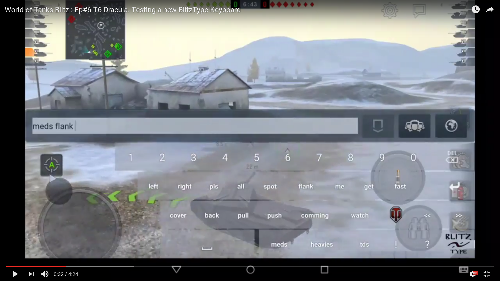

# BlitzType Keyboard

Android custom keyboard with special keys for the WOT Blitz game. QWERTZ layout. No shift (lowercase only). Custom buttons for most common commands.

##Video:

##Building

To build, just run gradle.

##Binary releases (apk download):
https://github.com/vanous/BlitzTypeKeyboard/releases

##Obligatory screenshots:

