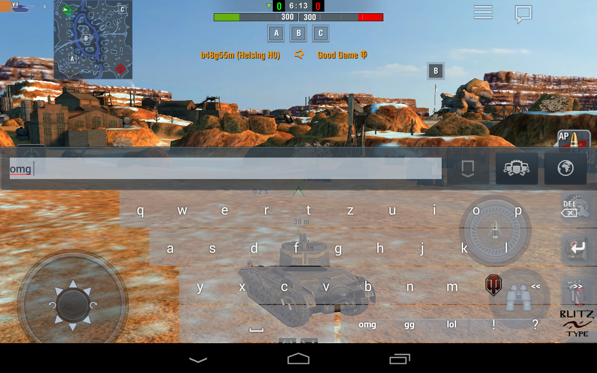

# BlitzType Keyboard

Android custom keyboard with special keys for the WOT Blitz game. QWERTZ layout. No shift (lowercase only). Custom buttons for most common commands.

## Video:

## Forum

http://forum.wotblitz.eu/index.php?/topic/36880-blitztype-keyboard-for-android/

## Building

To build, just run `./gradlew build`

## Binary releases (apk download):

## Obligatory screenshots:

# Apache-License

BlitzTypeKeyboard

## License
    
    Copyright 2019 Petr Vanek

    Licensed under the Apache License, Version 2.0 (the "License");
    you may not use this file except in compliance with the License.
    You may obtain a copy of the License at

       http://www.apache.org/licenses/LICENSE-2.0

    Unless required by applicable law or agreed to in writing, software
    distributed under the License is distributed on an "AS IS" BASIS,
    WITHOUT WARRANTIES OR CONDITIONS OF ANY KIND, either express or implied.
    See the License for the specific language governing permissions and
    limitations under the License.

# Original project:

All credits go to the original author:
https://android.googlesource.com/platform/development/+/master/samples/SoftKeyboard

Originally, project was forked from blackcj/AndroidCustomKeyboard , but i have since rebased it onto the original Android example code.
